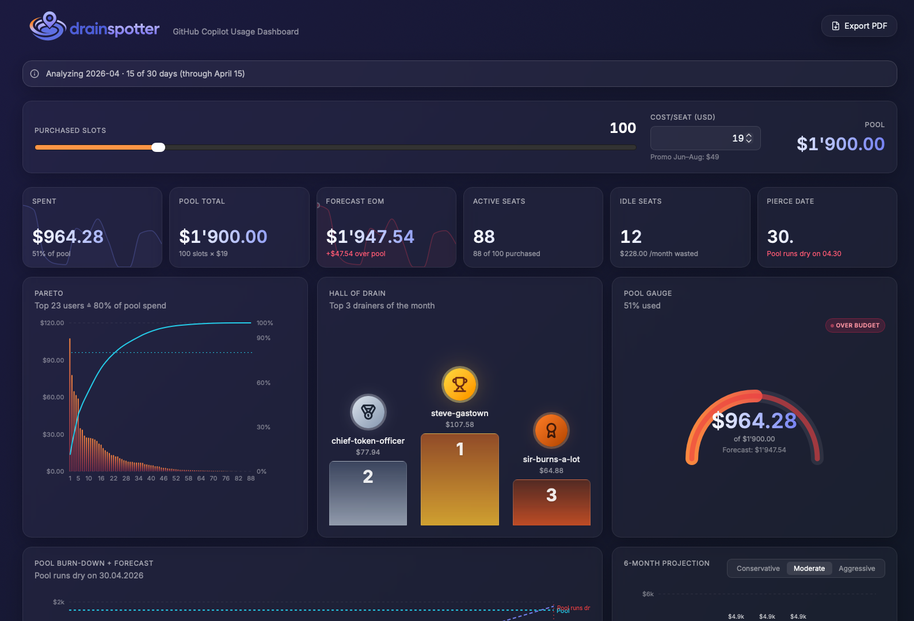

<p align="left">
  
</p>

A browser-only dashboard for the GitHub Copilot `AIUsageReport_*.csv`.

GitHub Copilot is moving to usage-based billing on June 1, 2026. Each Business
seat ($19/month) brings $19 of AI Credits — Enterprise seats ($39/month) bring
$39. During the Jun–Aug 2026 promo, GitHub gifts bonus credits on top (Business
$30, Enterprise $70 per seat). The credits aren't reserved per seat — they flow
into a shared org pool and any active user can drain it.

drainspotter takes the CSV, slaps a slider on top for "how many seats did we
actually buy", and answers the questions you actually have:

- How much of the pool is gone? How much is left?
- At the current burn rate, does the pool last to end of month, or run dry?
- Who are the top drainers? Who's over their fair share of $19/seat?
- Which models eat the budget — and how their credit cost compares?
- Which user is solo-driving up a specific model's cost?

<p align="center">
  
</p>

Everything runs client-side. The CSV never leaves the browser.

## Running it

```sh
npm install
npm run dev
```

Drop your CSV into the upload zone, or click "Load sample data" to play with
the demo dataset.

## Container build

```sh
docker compose up --build
```

`compose.yaml` has Traefik labels but a placeholder hostname
(`drainspotter.example.com`) and cert resolver (`letsencrypt`) — replace before
deploying. GitHub Actions builds and pushes a multi-tag image to
`ghcr.io/trick77/drainspotter` on every push to `master`.

## PDF export

Hit the "Export PDF" button. It triggers `window.print()` with a stylesheet
that switches to white-on-paper, drops the glass/blur, and lays out the charts
on A4 with sensible page breaks. The SVG charts stay vector — they're crisp
at any zoom in the PDF.

## What it doesn't do

- No multi-month history. You upload one CSV, you see one month. If the CSV
  contains data from more than one month, the latest one wins and a banner
  tells you.
- No backend, no database, no auth. Refresh and the data is gone (settings
  persist via `localStorage`, but the parsed CSV does not).
- No light theme.
- No re-upload button on the chart page — drop a new CSV anywhere on the
  drop zone, or refresh.

## Stack

Vite, React, TypeScript, Tailwind, Recharts, PapaParse, Vitest. nginx-alpine
in the container, behind Traefik.
